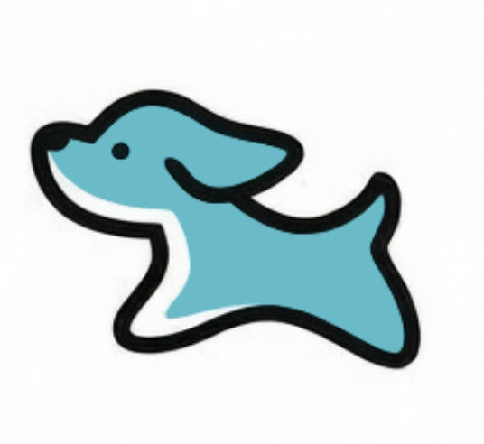
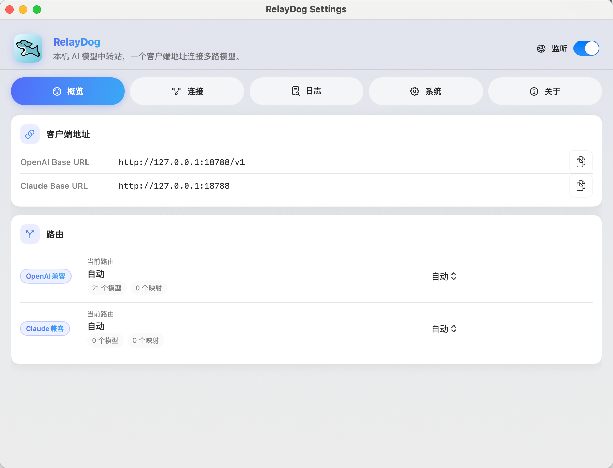

<div align="center">
  

  # RelayDog

  **本机 AI 模型中转站：一个客户端地址，连接多个上游模型服务。**

  A local macOS menu bar relay for OpenAI-compatible and Claude-compatible AI clients.

  [](https://github.com/JackyZhang8/relaydog/releases)
  
  
</div>

---

RelayDog 是一款常驻 macOS 菜单栏的本地 AI 请求中转工具。它为 Codex、Claude Code 及其他兼容客户端提供固定的本机地址，并将请求转发到你配置的多个 OpenAI 或 Claude 兼容上游。配置、路由状态和请求日志均保存在本机。

## 软件截图

<div align="center">
  
</div>

## 核心能力

- **统一客户端入口**：默认监听 `127.0.0.1:18787`，无需在不同上游地址之间反复切换。
- **双协议兼容**：根据请求路径与 Header 自动识别 OpenAI 兼容或 Claude / Anthropic 兼容请求。
- **多上游路由**：集中管理多个中转站，支持启用状态、权重、超时、备注与协议能力配置。
- **模型管理**：支持同步模型列表、手动维护模型，以及客户端模型名到上游模型名的映射。
- **运行状态与排障**：提供健康检查、请求统计和可选的本地请求日志。
- **原生菜单栏体验**：快速打开设置、复制客户端地址、切换路由和控制日志。
- **中英双语界面**：支持中文、English 及跟随系统语言。
- **数据留在本机**：RelayDog 不会主动上传你的配置、日志或请求内容。

## 快速开始

### 下载安装

前往 [GitHub Releases](https://github.com/JackyZhang8/relaydog/releases) 下载适合当前 Mac 架构的版本。

系统要求：

- macOS 13 或更高版本
- Apple Silicon（arm64）或 Intel（x86_64）Mac

### 从源码运行

需要安装 Xcode / Swift 6.1 工具链，然后执行：

```bash
git clone https://github.com/JackyZhang8/relaydog.git
cd relaydog
./dev.sh
```

启动后会打开设置窗口，并在 macOS 菜单栏显示 RelayDog 图标。

仅启动本地代理守护进程：

```bash
./dev.sh daemon
```

## 使用方法

1. 打开 RelayDog 设置，在「连接」页面添加一个上游服务。
2. 选择该上游支持 OpenAI 兼容协议、Claude 兼容协议，或同时支持两者。
3. 填写上游 `Base URL` 和 `API Key`。
4. 同步或手动添加模型；如有需要，再配置模型名称映射。
5. 返回「概览」页面，复制对应的客户端地址。
6. 将地址填入 Codex、Claude Code 或其他兼容客户端。

## 客户端配置

| 客户端类型 | Base URL | API Key |
| --- | --- | --- |
| OpenAI 兼容 | `http://127.0.0.1:18787/v1` | 填写任意占位值；真实 Key 由 RelayDog 的上游配置提供 |
| Claude / Anthropic 兼容 | `http://127.0.0.1:18787` | 填写任意占位值；真实 Key 由 RelayDog 的上游配置提供 |

> 如果你修改了监听地址或端口，请以 RelayDog「概览」页面显示的地址为准。

## 本地数据与隐私

RelayDog 默认将数据保存在：

```text
~/.relaydog/
├── config.json    # 上游、模型和路由配置
├── logs/          # 请求日志（默认关闭）
└── state.json     # 本地运行状态
```

请注意：

- `config.json` 当前会明文保存上游 API Key，请妥善保护该文件。
- 请求日志默认关闭；开启后可能包含 Header、Prompt、响应正文和 API Key 等敏感信息。
- 分享日志前，请先检查并移除密钥和业务数据。

## 开发

主要模块：

- `RelayDogMenuBar`：macOS 菜单栏应用入口
- `RelayDogApp`：设置窗口与菜单界面
- `RelayDogCore`：代理、协议识别、路由、配置、健康检查和日志
- `relaydogd`：独立本地代理守护进程

常用命令：

```bash
# 运行菜单栏应用
./dev.sh

# 运行守护进程
./dev.sh daemon

# 构建
swift build --product RelayDogMenuBar

# 测试
swift test
```

第一次使用？请参阅 [RelayDog 功能介绍与新手入门教程](RelayDog_Product_Design.md)，了解上游配置、客户端接入、模型映射和常见问题排查。

### 贡献
感谢 yang提供的logo设计

<details>


<summary><strong>English</strong></summary>

## About RelayDog

RelayDog is a local macOS menu bar relay for AI clients. It exposes stable local endpoints and routes OpenAI-compatible and Claude-compatible requests to your configured upstream gateways. Configuration, routing state, and optional request logs stay on your Mac.

### Highlights

- One local endpoint for multiple upstream AI gateways
- Automatic OpenAI / Claude protocol detection
- Weighted routing, timeout settings, health checks, and upstream enable toggles
- Model synchronization and model-name mapping
- Local request statistics and optional diagnostic logs
- Native macOS menu bar controls
- Chinese, English, and system language modes

### Client endpoints

| Client type | Base URL |
| --- | --- |
| OpenAI-compatible | `http://127.0.0.1:18787/v1` |
| Claude / Anthropic-compatible | `http://127.0.0.1:18787` |

Use any placeholder API key in the client. RelayDog injects the actual key configured for the selected upstream.

### Run from source

RelayDog requires macOS 13 or later and the Swift 6.1 toolchain.

```bash
git clone https://github.com/JackyZhang8/relaydog.git
cd relaydog
./dev.sh
```

Download packaged builds from [GitHub Releases](https://github.com/JackyZhang8/relaydog/releases).

</details>
